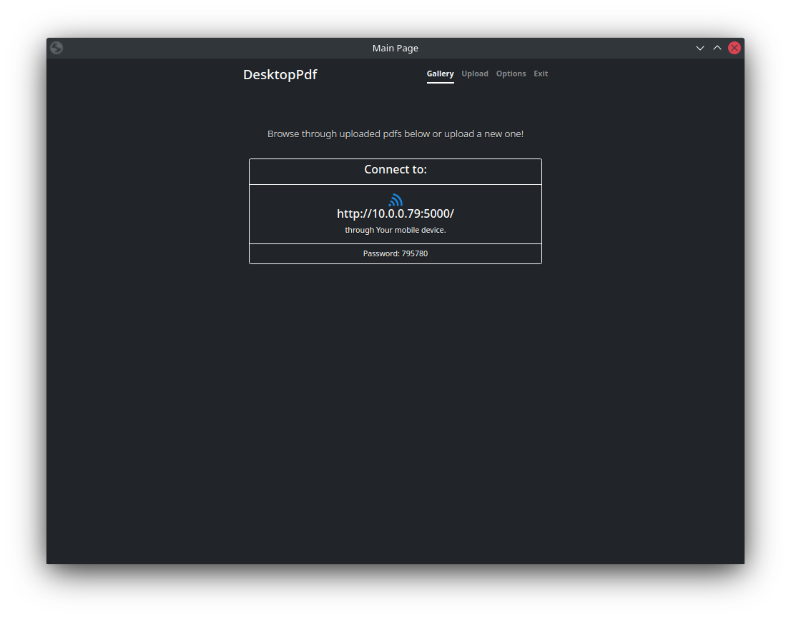
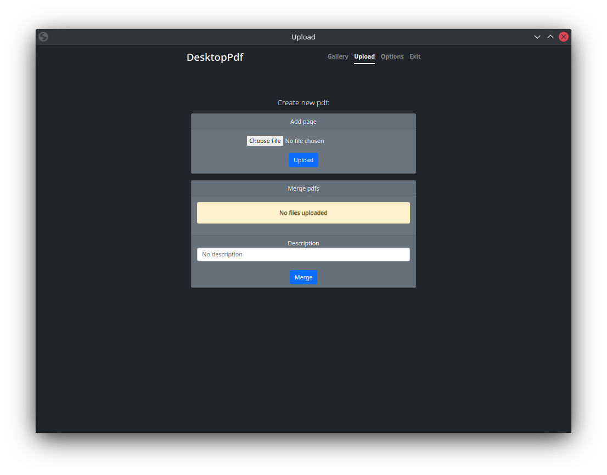
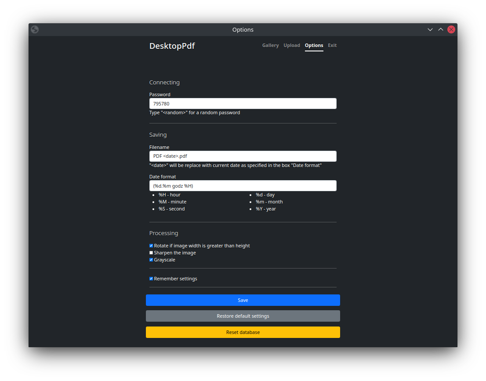

# DesktopPdf

Application for uploading photos from a mobile device and converting it to a pdf file.

## How it looks like






## Requirements
Aside from python packages listed in `requirements.txt` the app also requires **Google Chrome**.

## How to run

```angular2html
    $ pip install -r requirements.txt
    $ python run.py
```

## How to use
1. Run the app on your desktop computer (see *How to run*)
2. Open web browser on your mobile device and open address displayed in the application
3. Go into *Upload* and upload your photo.
4. Access the pdf in the folder *pdfs*.
